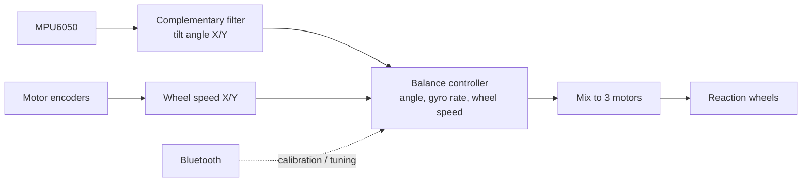

# Self-Balancing-Cube

A Cubli-style cube that balances on a vertex or an edge using three reaction wheels.

ESP32, MPU6050, Nidec 24H brushless motors, 500 mAh LiPo battery.

## What's in this repository

| Folder | Board | Description |
|--------|-------|-------------|
| [`esp32_cube_enc/`](esp32_cube_enc) | ESP32 | **Current firmware.** Uses the motor encoders and WS2812B status LEDs. |
| [`ESP32_cube/`](ESP32_cube) | ESP32 | Original firmware, without encoders. |
| [`arduino_cube/`](arduino_cube) | Arduino Nano | Port of the original firmware. All other parts remain the same. |
| [`motors_test/`](motors_test) | ESP32 | Test sketch: checks all motors, rotation directions and encoders. |

Each folder is a standalone Arduino sketch.

> **Update (2024-07-14):** the new code is in the `esp32_cube_enc` folder. The sensor
> orientation changed, so if you built the earlier cube you need to reprint one part to use
> this code — or print the redesigned cube: https://www.thingiverse.com/thing:6695891

## Hardware

- ESP32 dev board (or Arduino Nano for `arduino_cube`)
- MPU6050 gyro/accelerometer
- 3 × Nidec 24H brushless motor with built-in driver and encoder

  
- Battery: 3S1P LiPo (11.1 V), 500 mAh
- Buzzer: any 5 V active buzzer
- Voltage regulator: any 5 V regulator (7805)
- 3 × WS2812B LED (`esp32_cube_enc` only)

### Schematic (ESP32)

Full resolution: [`schematic.pdf`](schematic.pdf)

The red connections in the schematic are the encoder lines. They **must be connected** for
`esp32_cube_enc` and `motors_test`. The original `ESP32_cube` firmware does not use them,
but if you are designing a PCB it is recommended to make these connections anyway.

### Schematic (Arduino Nano)

Full resolution: [`arduino_schematic.pdf`](arduino_schematic.pdf)

## Building and flashing

Open the sketch folder in the Arduino IDE, select the board and upload.

- **ESP32 sketches** need the *esp32* board package. The code uses the `ledcSetup` /
  `ledcAttachPin` PWM API from **core 2.x**; these functions were removed in core 3.x, so
  install a 2.x version of the package (or port the PWM calls).
- Bluetooth is Bluetooth Classic (`BluetoothSerial`), so an original ESP32 is required —
  not an S2/S3/C3.
- `esp32_cube_enc` also needs the **FastLED** library.
- The serial monitor runs at 115200 baud.

## How it works

The control loop runs every 15 ms (10 ms in the older sketches). When the cube is held
close to a calibrated balancing point the controller takes over; if it tilts more than a
few degrees the motors stop and the brake is applied.

At power-up the firmware measures the gyro offsets for a few seconds — **keep the cube
still until the beeps finish.**

## Calibrating the balancing points

The cube will not balance until its balancing points are calibrated. Offsets are stored in
EEPROM, so this is only needed once.

### `esp32_cube_enc`

Video: https://youtu.be/ZU0oTBRDgOE

1. Connect to the `ESP32-Cube` Bluetooth device with a serial terminal. You will see a
   message that you need to calibrate the balancing points (the LEDs blink).
2. Send `c+` to start calibration.
3. Set the cube on its **vertex**. Hold it still at the point where it does not fall to
   either side and send `c-`. You should see `Vertex OK.`
4. Set the cube on its **edge**, hold it still and send `c-`. You should see `Edge OK.`
   The offsets are saved and the cube begins to balance.

If you see `The angles are wrong!!!` the cube was not close enough to the expected
position — reposition it and send `c-` again.

### `ESP32_cube` and `arduino_cube`

Video: https://youtu.be/Nkm9PoihZOI

1. Connect over Bluetooth (`ESP32-Cube-blue` for the ESP32 version).
2. Send `c+` to start calibration.
3. Set the cube on one of its balancing points (edge or vertex). Hold it still where it
   does not fall to either side and send `c-`. This writes the offsets to EEPROM.
4. Repeat for all four points (3 edges and the vertex). After all offsets are calibrated
   the cube begins to balance.

## Tuning over Bluetooth

In `ESP32_cube` and `arduino_cube` the balancing controller can be tuned remotely. Commands
are two characters and can be repeated in one message:

| Send | Effect |
|------|--------|
| `p+` / `p-` (or `p+p+p+p+`) | increase / decrease K1 |
| `i+` / `i-` | increase / decrease K2 |
| `s+` / `s-` | increase / decrease K3 |
| `b+` / `b-` | adjust battery divider (`arduino_cube` only) |

Tuned values are not saved; copy them into the header file once you are happy with them.
In `esp32_cube_enc` the gains are set in `ESP32.h` and only the calibration command is
available over Bluetooth.

## Battery

The buzzer sounds continuously when the battery is low (between 8 V and 9.5 V). The voltage divider
constant in the code (`analogRead(VBAT) / 204`) must be adjusted by measuring your actual
battery voltage.

## Troubleshooting

If something doesn't work, try the `motors_test` sketch. It cycles through every motor —
rotate, stop, reverse, stop, encoder check — and prints the results to the serial monitor.
This helps you understand whether the problem is in software or in hardware.

## Build videos

- How to build: https://youtu.be/AJQZFHJzwt4
- Encoder version: https://youtu.be/ZU0oTBRDgOE
- Setting the balancing points: https://youtu.be/Nkm9PoihZOI

