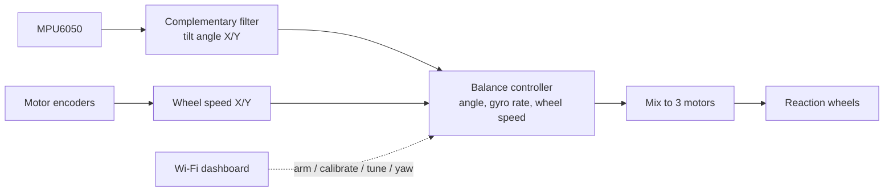

# Self-Balancing-Cube

A Cubli-style cube that balances on a vertex or an edge using three reaction wheels.

ESP32, MPU6050, Nidec 24H brushless motors, 500 mAh LiPo battery.


## What's in this repository

| Path | Description |
|------|-------------|
| [`esp32_cube_enc/`](esp32_cube_enc) | Balancing firmware for the ESP32. Uses the motor encoders, WS2812B status LEDs and a Wi-Fi dashboard. Built with PlatformIO. |
| [`motors_test/`](motors_test) | Arduino sketch that checks all motors, rotation directions and encoders. |
| [`battery_test/`](battery_test) | Arduino sketch that holds the motors stopped and prints the battery voltage. Type a multimeter reading to get the correct divider constant for the firmware. |
| [`tools/`](tools) | Build helper for the dashboard page and checks for the estimator math. |
| [`PCBGerber/`](PCBGerber) | Gerber files for a PCB. |

The older firmware without encoders (`ESP32_cube`) and the Arduino Nano port
(`arduino_cube`) were removed from this branch. They are still available on the `main`
branch.

> The sensor orientation in `esp32_cube_enc` differs from the original cube. Upstream's
> advice is to reprint one part, or print the redesigned cube:
> https://www.thingiverse.com/thing:6695891. Alternatively, keep the original sensor holder
> and set `IMU_MOUNT 1` in `esp32_cube_enc/ESP32.h`.
>
> If the cube reads far from upright at its vertex balance point (raw X or Y on the
> dashboard well away from 0), check the accelerometer before assuming the sensor is
> tilted: some MPU6050s have a large zero offset on one axis. Lay the cube still on its
> three wheel faces, note the raw `X Y Z` for each, and run
> `python tools/accel_offsets.py X,Y,Z X,Y,Z X,Y,Z`. It prints `ACC_OFFSET_*` values for
> `ESP32.h` and the board's real tilt. Recalibrate after changing them.
>
> Motor numbering must also match the control geometry: motor 3 is the wheel that balances
> the edge by itself, and if the vertex throws the cube over sideways, swap the pins of
> motors 1 and 2 in `ESP32.h`.

## Hardware

- ESP32 dev board (original ESP32, e.g. ESP-WROOM-32)
- MPU6050 gyro/accelerometer
- 3 × Nidec 24H brushless motor with built-in driver and encoder

  
- Battery: 3S1P LiPo (11.1 V), 500 mAh
- Buzzer: any 5 V active buzzer
- Voltage regulator: any 5 V regulator (7805)
- 3 × WS2812B LED

### Schematic


Full resolution: [`schematic.pdf`](schematic.pdf)

The red connections in the schematic are the encoder lines. They **must be connected**.

## Building and flashing

### Balancing firmware (PlatformIO)

```
pio run                 # build
pio run -t upload       # flash
pio device monitor      # serial monitor, 115200 baud
```

- The firmware uses the arduino-esp32 **core 3.x** PWM API (`ledcAttach`), provided by the
  pioarduino platform pinned in `platformio.ini`. The pinned release works with PlatformIO
  Core 6.1.x; newer platform releases need Core 6.2.0 or later.
- The dashboard page is gzipped into `esp32_cube_enc/dashboard_gz.h` by a pre-build script.
  That file is generated and git-ignored, so the Arduino IDE cannot build this firmware
  as-is.
- FastLED is fetched automatically.

Before flashing, set your own access-point password in
`esp32_cube_enc/web_interface.cpp` (`WIFI_PASSWORD`). WPA2 requires at least 8 characters —
a shorter one means the network never starts.

### Motor test (Arduino IDE)

Open `motors_test/` in the Arduino IDE with the *esp32* board package **3.x** and upload.

## How it works



The control loop runs every 15 ms. When the cube is armed and held close to a calibrated
balancing point the controller takes over; if it tilts more than 7° the motors stop and
the brake is applied.

At power-up the firmware measures the gyro offsets for a few seconds — **keep the cube
still until the beeps finish.**

**The cube boots disarmed**, with the brake engaged. It will not balance until you press
ARM on the dashboard (or send `a+` over USB serial).

## Wi-Fi web interface

The cube hosts its own Wi-Fi access point, so no router or internet is needed. Connect a
phone to the **Cube-Control** network and open **http://192.168.4.1** (phones usually offer
it automatically as a sign-in page; laptops can also use `http://cube.local`).

The dashboard shows live tilt on an attitude target (the outer ring is the ±7° angle at
which balancing disengages), the three motor speeds, raw accelerometer values, battery
voltage, status and a live trace of the control loop. From it you can:

- **SAFE STOP / ARM / DISARM** — stop the motors and keep them stopped
- **Calibrate** — start, capture each pose, save to EEPROM
- **Tune gains** — edit K1–K4, zK2, zK3, eK1–eK4, the auto-trim rate `tK`, heading hold
  `zK1` and battery compensation `vNom` live, with validation and limits.
  Changes apply immediately but are only written to EEPROM when you press Save. There is
  also a Restore Defaults button.
- **Yaw** — command a rotation rate about the vertical axis, turn by a number of degrees,
  or hold the current heading (`zK1`). Heading is gyro dead reckoning, not a compass, so it
  drifts over minutes.
- **Auto-trim** — let the cube learn its true balance point from sustained wheel speed
  (`tK`, off by default). The learned trim is saved with the gains.

Bluetooth has been removed: it was 40% of the firmware image, the web interface replaced
everything it did, and Espressif rates a simultaneous SoftAP + Bluetooth Classic as
unstable on the ESP32's shared radio.

### USB serial fallback

If the access point is unavailable, two-character commands work over USB serial at
115200 baud:

| Send | Effect |
|------|--------|
| `a+` / `a-` | arm / disarm |
| `c+` | start calibration |
| `c-` | capture the current pose |

## Calibrating the balancing points

The cube will not balance until its balancing points are calibrated. Offsets are stored in
EEPROM, so this is only needed once. Calibration is refused while the cube is actively
balancing — disarm first.

Video (shows the same two poses, using the older Bluetooth commands):
https://youtu.be/ZU0oTBRDgOE

1. Open the **Calibration** section of the dashboard and press **Start**.
2. Set the cube on its **vertex**. Hold it still at the point where it does not fall to
   either side and press **Capture pose**.
3. Set the cube on its **edge**, hold it still and capture again. The second capture
   writes the offsets to EEPROM automatically.

The dashboard shows the raw accelerometer counts and tells you whether each pose was
accepted. If a pose is rejected the cube was not close enough to the expected position —
reposition it and capture again.

## Battery

The firmware checks the 3S pack twice a second (smoothed over a couple of seconds):

| Pack voltage | State | What happens |
|---|---|---|
| above 10.5 V | OK | nothing |
| below 10.5 V | LOW | slow blink on the ESP32 board's LED, the WS2812s and the buzzer (if fitted); dashboard shows BATTERY LOW |
| below 9.9 V for 2 s | CUTOFF | disarms (the cube drops if it was balancing), fast blink; arming is refused until the pack reads 10.8 V or the cube is restarted |
| below 6 V | no battery | running from USB only; no warning |

**Voltage compensation (optional).** As the pack drains, the same motor command gives less
torque and the controller gets weaker. Set the gain `vNom` in the dashboard's gains panel
to the voltage your gains were tuned at (e.g. `11.5`) and every motor command is scaled by
`vNom / battery voltage` (limited to ×0.90–×1.25), so the cube behaves the same across the
discharge; the battery pill then shows the factor, e.g. `10.80 V ×1.06`. `0` (the default)
turns it off. It cannot add torque a flat pack does not have.

The voltage divider constant `BATT_ADC_PER_VOLT` in `esp32_cube_enc/ESP32.h` (225) depends
on your board's resistors and must be adjusted by measuring your actual battery voltage.
The `battery_test` sketch does this: run it with the battery connected, type your
multimeter reading, and it prints the constant to use. (225 was measured on one cube;
upstream used 204.)

## Troubleshooting

If something doesn't work, try the `motors_test` sketch. It cycles through every motor —
rotate, stop, reverse, stop, encoder check — and prints the results to the serial monitor.
This helps you understand whether the problem is in software or in hardware.

After changing `angle_calc()` or the heading loop, run the estimator checks:

```
python tools/test_estimator.py
```

## Self-righting ("jump up onto an edge") — tried, and why it doesn't work

A jump-up was implemented and tested on this cube: spin a reaction wheel to
high speed, brake it hard, and let the transferred angular momentum tip the
cube from lying flat onto one of its edges. **It does not work with motor
braking on this hardware, and the reason is torque, not momentum.** The code
was removed again; it lives in the git history if you want it.

### What was measured

| | |
|---|---|
| Cube mass | 996 g |
| Flywheel | 74 g, 125 mm OD |
| Peak wheel speed | 420 encoder counts per 15 ms loop |
| Time to reach that peak | 2402 ms |
| Cube rotation when braked | **0.1°** (i.e. none), by gyro integration |

Both the driver's `BRAKE` input and active reverse-driving of the motor were
tried, at brake durations from 60 to 250 ms. All gave the same result.

### Why

Lying flat, the cube's own weight holds it down with a leverage of half an
edge length — roughly **0.68 N·m**. Until the wheel's braking reaction
exceeds that, the cube does not tip a little; it does not tip **at all**.
The floor simply redistributes its normal force to absorb any smaller
couple. This is a threshold, not a proportional response, which is why no
combination of brake duration or target speed produced partial movement.

A motor short-circuit brake sheds the wheel's momentum on roughly the same
time constant it took to spin it up (~0.5–0.8 s here, inferred from the
2402 ms rise). That yields perhaps **0.05–0.3 N·m** — somewhere between 3×
and 20× short of the threshold. Worse, gravity cancels the impulse within
about 130 ms, and in that window an exponential brake delivers only 15–23%
of the stored momentum.

The stored momentum itself is *also* marginal — about 0.4–0.9× of what the
tip-up needs, once the encoder resolution is bounded by a power sanity check
(the pack simply cannot supply the current that a low count-per-rev would
imply). So the flywheel is not oversized either; it is just not the binding
constraint.

**Uncertainty, stated honestly:** the encoder's counts-per-revolution and
the cube's edge length were never measured, so the wheel's true RPM is known
only to within about a factor of two. The conclusion is robust to that — the
torque deficit does not close anywhere in the plausible range — but the
individual numbers above should be read as ranges, not measurements.

### What would actually change it

Ranked by leverage:

1. **A mechanical brake.** A servo barrier or solenoid pawl arresting the
   wheel in under ~10 ms gives 5–13 N·m, clearing the threshold by an order
   of magnitude. This is what the ETH Zurich Cubli uses, and why. It is the
   only fix that works with these motors.
2. **Much larger motors, no brake at all.** The approach taken by the
   Wheelbot (Geist et al., ICRA 2022): pick motors whose *continuous* torque
   exceeds the tipping threshold outright. That is roughly 30× a Nidec 24H.
3. **Lower the threshold instead of raising the torque.** The threshold is
   set by the support half-width, not by anything fundamental. Resting the
   cube on a narrow central ridge collapses it toward zero. **This is the
   cheapest decisive experiment here** — if the cube tips off a ridge but
   not off a flat face, the whole analysis is confirmed for the price of one
   printed part. Pre-tilting has the same effect: starting 20° up drops the
   threshold to ~0.41 N·m.
4. **More wheel momentum** (rim-weighted flywheel, higher pack voltage —
   brake torque is proportional to wheel speed, so voltage genuinely helps).
   Needed anyway, but on its own it does not clear the gate.

If you want to re-open this, the three measurements worth taking first are:
the encoder's counts per revolution (mark the wheel and count edges), the
wheel-speed decay curve through a brake event (this measures the brake time
constant directly), and the cube's edge length.

### Two firmware notes found along the way

- **`Motor*_control(0)` does not mean "stop".** It adds the measured wheel
  speed to the command (`sp = sp + motorN_speed`) before clamping, so once
  a wheel exceeds 255 counts/loop, commanding zero produces *full drive*.
  This is why the jump code drove the motor directly instead. Not fixed,
  because it is baked into the current tuning.
- **The gyro scale was inconsistent, and has since been fixed.** `gyroSens = 0`
  selects ±250 °/s (131 LSB per °/s), but the angle integration in
  `angle_calc()` divided by `65.536`, the ±500 °/s constant, and did so in
  integer math. Both now use `GYRO_LSB_PER_DPS` in float. The default gains
  were tuned around the old behaviour, so they may need retuning.

## Build videos

- How to build: https://youtu.be/AJQZFHJzwt4
- Encoder version: https://youtu.be/ZU0oTBRDgOE


