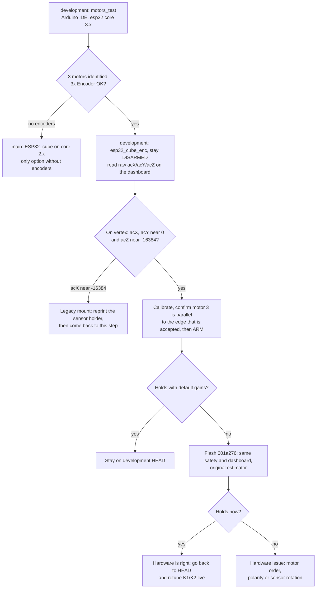

# development-branch-assessment

Assessment of the `development` branch (`fd62361`, 2026-08-06, remote `DuckieOnQuacks`, local `duck/development`) against `main` (`fb729c6`), and the recommended sketch + branch combination for an ESP32 build whose motor order and sensor orientation are not yet known.

Evidence: full read of the branch source; its `tools/test_estimator.py` run locally (13/13 pass — it models the arithmetic and greps the source, it does not execute firmware). **Compiled** on 2026-10-02 with PlatformIO Core 6.1.19 and the platform pinned to pioarduino `55.03.311`: builds clean apart from `-Wvolatile` warnings in the encoder ISRs; flash 38 % of the `huge_app` partition, RAM 21 %. Nothing was run on hardware. *(inferred)* marks conclusions drawn from the math.

## Shape of the change

16 commits ahead of `main`, zero behind (fast-forwardable). +7494 / −1335 lines.

- `esp32_cube_enc` rewritten as three `.cpp` files plus a header of `extern` declarations; there is no `.ino` any more.
- New `web_interface.cpp` (1168 lines, about 600 of them the inlined dashboard page).
- Bluetooth removed; replaced by a Wi-Fi access point and HTTP API.
- `ESP32_cube/` and `arduino_cube/` deleted, with the Nano schematic.
- Added `platformio.ini`, `tools/` (dashboard gzip step, estimator tests), `PCBGerber/` (PCB files, not assessed).
- `motors_test` ported to the core 3.x PWM API, otherwise unchanged.

## Hardware compatibility — unchanged

Pin map, IMU axis math, pose thresholds (vertex `|AcX| < 2000`; edge `|AcX|` 7000–10000), motor mixer, `OffsetsObj` and its magic (`ID == 96`) are identical to `main`'s `esp32_cube_enc`. So:

- The branch needs exactly the same build: encoders wired, chip Z pointing down in the vertex stance, motor 3's shaft parallel to the one supported edge.
- An existing calibration survives the upgrade. EEPROM grows 64 → 128 bytes; gains are stored at offset 32 with their own magic.
- It offers nothing for a legacy sensor mount (chip X down) or for a cube without encoders.

## What happened to the known `main` defects

| `main` defect | On `development` |
|---|---|
| Does not build on arduino-esp32 core 3.x | **Reversed**: now uses `ledcAttach`, so it needs core 3.x and no longer builds on 2.x |
| Gyro integration at 2× scale, plus integer truncation (`GyY * loop_time / 1000` is int math, so rates under ~0.5 °/s integrated to zero) | **Fixed** in the last commit: float math, single `GYRO_LSB_PER_DPS` constant, measured `dt` clamped to 5–45 ms |
| Motor command not clamped before `255 - abs(sp)` | **Fixed**: clamped to ±255 after the speed feedback is added |
| No low-voltage cutoff | Not fixed at `fd62361`. Added on the local branch 2026-10-03: warn < 10.5 V, latched disarm < 9.9 V, onboard-LED blink, dashboard pill |
| Battery constant `204` questionable | Not fixed. On the user's cube a 12.0 V pack reads raw 2700, so the constant should be ~225 there; `204` reads 13.2 V and the 8–9.5 V buzzer band would fire only at a real ~7.3–8.8 V, i.e. 2.4–2.9 V per cell *(inferred from one measurement)* |
| Encoder counts read and zeroed without masking interrupts | Not fixed |
| No I2C error handling | Not fixed |
| LEDs declared `RGB` | Not fixed |
| ~8 s blocking gyro calibration at boot | Unchanged |
| One edge only, no live tuning | Still one edge; **live tuning added** (12 gains, validated ranges, explicit save) |

## New behaviour

- **Boots disarmed, brake engaged.** PWM is attached and zeroed first thing in `setup()`. Balancing needs an explicit ARM from the dashboard or `a+` over USB serial. On `main` the cube starts balancing by itself as soon as a pose is detected.
- **Dashboard** at `http://192.168.4.1` on AP `Cube-Control` (captive portal, also `cube.local`): live angles, raw accelerometer counts, wheel speeds, battery, 66 Hz telemetry trace, SAFE STOP / ARM / DISARM, calibration, gain editing.
- **USB serial fallback** at 115200: `c+` / `c-` calibration, `a+` / `a-` arm and disarm. Calibration is refused while balancing.
- **Yaw**: commanded yaw rate (±90 °/s), relative turns and heading hold by gyro dead reckoning (`zK1`). Hold is inactive until a turn is requested.
- **Auto-trim** of the balance point from sustained wheel speed (`tK`, default 0 = off), saved with the gains.
- Stop always wins over a pending arm; a fall clears any yaw command.

## New risks

| # | Severity | Finding |
|---|---|---|
| 1 | High | **Default gains predate the estimator fix.** `K1`/`K2` etc. are upstream's values, tuned against an angle estimate whose gyro half ran at 2×. With the fix the fast part of the angle signal is about half as large, so effective angle gain drops *(inferred)*. Nothing in the branch shows the defaults were retuned; its own README still says the fix "would require retuning". |
| 2 | Medium | PlatformIO only. No `.ino`, and `dashboard_gz.h` is generated by a pre-build script, so the Arduino IDE cannot build it as-is. FastLED is unpinned, and the platform URL is the floating `pioarduino … stable` link: since 2026-09-20 that resolves to `55.03.312`, which needs PlatformIO Core ≥ 6.2.0 and fails on 6.1.19. Pin `releases/download/55.03.311/` (the release current when the branch was written) or upgrade Core. |
| 3 | Medium | Access-point password is committed in source (`web_interface.cpp`) and the HTTP API has no further authentication; anyone who joins can arm the motors or change gains. Change it before use. |
| 4 | Medium | HTTP is served synchronously from `loop()`, so a page load or slow client stalls the control loop for several periods. Mitigated by gzip, a 40-sample trace cap and the measured-`dt` clamp, not eliminated. |
| 5 | Low | Stale documentation: README says the gyro scale is unfixed and links a deleted image; a header comment says `armed` defaults to true; a setup comment still mentions Bluetooth. |
| 6 | Low | `cal_save` can persist after the vertex pose alone, leaving edge offsets uninitialised (NaN on a fresh flash) *(inferred)*. |
| 7 | Low | Auto-trim integrates with nominal `loop_time`, not measured `dt`. Off by default. |
| 8 | Low | `MotorN_control(0)` still adds measured wheel speed, so a zero command is not zero drive on a spinning wheel. Documented by the branch, deliberately left. |
| 9 | Info | Legacy firmware and Bluetooth are gone; no path for a Nano or a legacy sensor mount. |

## Recommended combination

Why this combination:

- **`motors_test` from `development`** — it is still a plain `.ino`, and it is the only version that builds on esp32 core 3.x, which is what is installed here (3.0.3).
- **`esp32_cube_enc` from `development`** — for an unverified build the decisive features are that it boots disarmed with the brake on, shows raw accelerometer values live, has a SAFE STOP, and clamps motor commands. `main` self-engages on pose detection, which is the wrong behaviour while motor order and polarity are unknown.
- **`001a276` as a diagnostic step** — it already has the safe boot, clamping, dashboard and trace, but still the original estimator the default gains were tuned for. If the cube balances there and not on HEAD, the cause is tuning, not wiring.
- **`main`** is only the fallback: `ESP32_cube` if there are no encoders or the sensor stays in the legacy orientation (needs core 2.x), or `esp32_cube_enc` if PlatformIO is unavailable.

Before the first armed run: change the Wi-Fi password, and check the dashboard battery voltage against a multimeter.
