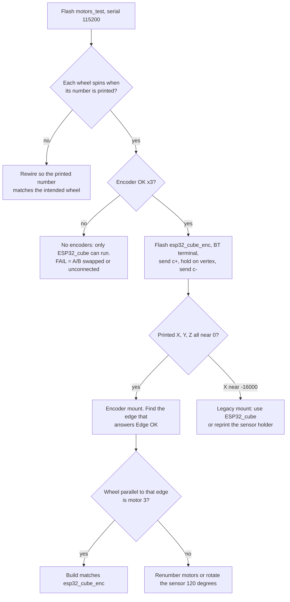

# firmware-assessment

Baseline assessment of the four sketches on `main` at `fb729c6` (2024-07-20): what each assumes about the hardware, known defects, and how to match a physical build to a sketch.

Read from source only — nothing here was compiled or run on hardware. Items marked *(inferred)* are derived from the math, not observed.

## Sketch comparison

| | `esp32_cube_enc` | `ESP32_cube` | `arduino_cube` | `motors_test` |
|---|---|---|---|---|
| Board | ESP32 classic | ESP32 classic | Nano | ESP32 classic |
| Loop period | 15 ms | 10 ms | 10 ms | 100 ms |
| Wheel speed source | encoders | integrated PWM (estimate) | integrated PWM | encoders |
| Balancing points | vertex + **1** edge | vertex + 3 edges | vertex + 3 edges | — |
| Yaw control on vertex | yes (`zK2`, `zK3`) | no | no | — |
| Live gain tuning | no | `p` `i` `s` | `p` `i` `s` `b` | — |
| Link | BT `ESP32-Cube` | BT `ESP32-Cube-blue` | hardware `Serial` | USB serial |
| Gyro range (`gyroSens`) | 0 = ±250 °/s | 1 = ±500 °/s | 1 = ±500 °/s | — |
| EEPROM magic | `ID == 96` | `ID1..4 == 99` | `ID1..4 == 99` | — |
| Extra libs | FastLED | — | — | — |
| Needs encoder wires | yes | no | no | yes |

Both ESP32 firmwares and `motors_test` share one pin map (motor 1: DIR 4 / PWM 32, motor 2: DIR 15 / PWM 25, motor 3: DIR 5 / PWM 18; brake 26, buzzer 27, VBAT 34), so the same wiring serves all three. Only the IMU mount differs.

## What each firmware assumes about the build

An axis that reads about −16384 (−1 g) is pointing straight down.

**`esp32_cube_enc`**
- On the vertex: `AcX ≈ 0`, `AcY ≈ 0`, `AcZ ≈ −16384`. Chip Z points down through the balancing vertex; the board lies horizontal in the vertex stance.
- On its one supported edge: `|AcX|` 7000–10000 (ideal ≈ 9460, i.e. 35.3°) and `|AcY| < 2000`. Vertex → edge is a rotation about chip Y.
- Motor 3 alone balances the edge, so motor 3's shaft is parallel to that edge, and chip X lines up with motor 3's shaft when viewed from above in the vertex stance. Motors 1 and 2 sit at ±120°.
- The other two edges give roughly `AcX ≈ −4700`, `|AcY| ≈ 8200` and are rejected *(inferred)*.

**`ESP32_cube` / `arduino_cube`**
- On the vertex: `AcX ≈ −16384` — chip X points down, i.e. the board is rotated 90° relative to the encoder firmware's mount. This is the part upstream says must be reprinted.
- Tilt X integrates `GyZ`, tilt Y integrates `GyY`.
- Calibration accepts (X°, Y°): vertex within ±10, ±10; edge on motor 1 at −45..−25, −30..−10; edge on motor 2 at 20..40, −30..−10; edge on motor 3 at ±15, 30..50.

## Matching a physical build to a sketch

Notes on the procedure:
- `motors_test` prints `Rotating motor N`, reverses it, then checks the encoder. `Encoder OK` needs more than 300 counts per 100 ms; `Encoder FAIL` is printed only at ≤ 0; anything between prints nothing.
- `c-` in `esp32_cube_enc` always prints raw `X: Y: Z:` (Z has 16384 added), which makes it a free orientation probe. Nothing is written to EEPROM until the edge step succeeds.
- Calibration checks magnitudes only. A sensor turned 180° about chip Z, or a motor with reversed polarity, passes calibration and then drives the cube over instead of catching it *(inferred)*.
- If the edge balances but the vertex does not, suspect motors 1 and 2 swapped: the edge uses motor 3 only *(inferred)*.
- `motors_test` uses the opposite direction sign from the firmware (`sp > 0` → DIR LOW there, `sp < 0` → DIR LOW in firmware). Its encoder check expects positive counts with DIR HIGH, which is what firmware treats as positive.

## Defects and risks in `esp32_cube_enc`

| # | Severity | Finding |
|---|---|---|
| 1 | High | Does not build on arduino-esp32 core 3.x: `ledcSetup` / `ledcAttachPin` were removed. Needs core 2.x or a port to `ledcAttach`. |
| 2 | High | Gyro scale mismatch. `gyroSens 0` gives 131 LSB per °/s, but tilt integration divides by 65.536, so the gyro term of the angle estimate runs at 2×. The same line is integer math (`GyY * loop_time / 1000` truncates before the float divide), so rates under about 0.5 °/s integrate to zero. The complementary filter (0.996) pulls it back slowly; gains are tuned around the error. |
| 3 | Medium | Motor commands are not clamped. `MotorN_control` adds `motorN_speed` and writes `255 - abs(sp)`; the mixer can already exceed 255, so the duty goes negative and is passed as `uint32_t`. Behaviour at saturation is undefined. |
| 4 | Medium | No low-voltage cutoff. The buzzer sounds only between 8 V and 9.5 V computed; motors keep running. |
| 5 | Medium | Battery constant `204` does not obviously match the drawn divider (33 kΩ / 10 kΩ on a 12-bit, 3.3 V ADC suggests about 290). If so the warning triggers far too late. Measured on one cube (2026-10-03): 12.0 V pack gave raw 2700 and 2.317 V at the pin, so the constant there is ~225 and the real ratio 5.18, matching neither 204 nor the drawn divider. `battery_test` derives it per board. |
| 6 | Low | `enc_countN` is read then zeroed without masking interrupts; counts arriving in between are lost. |
| 7 | Low | `Tuning()` discards a lone first byte if the second has not arrived yet, so a command split across ticks is dropped. |
| 8 | Low | No I2C error handling; a disconnected IMU yields garbage that is used as data. |
| 9 | Low | LEDs declared `RGB` for WS2812B (normally GRB), so red and green are swapped against the code's intent. |
| 10 | Low | Boot blocks about 8 s for gyro offsets (3 passes × 512 samples); moving the cube then biases every later angle. |
| 11 | Info | Only one edge is supported, a regression from three in the legacy firmware. No live gain tuning. |

Legacy sketches: the same core 3.x problem applies to `ESP32_cube`. They have the inverse scale quirk — integration is correct for ±500 °/s but the rate term divides by 131, so `K2` acts on half the true rate. Their wheel-speed term is an integral of commanded PWM, not a measurement.

## Structural observations

- Every sketch is standalone; pin maps, motor helpers and encoder ISRs are duplicated and have already drifted (direction sign, clamping, battery constant 204 / 207 / tunable).
- All state is global and declared in the header, so each header can be included by one translation unit only.
- No tests, no CI, no pinned core or library versions.
- Strengths: small and readable, real wheel-speed feedback and yaw damping in the encoder version, calibration persisted, and a dedicated bring-up sketch.

## Using this as a comparison baseline

When assessing another branch against this one, check in order: defects 1–3 fixed or not, whether the pin map or IMU axis convention changed (that decides hardware compatibility), whether `OffsetsObj` or its magic changed (forces recalibration), and whether edge count or tuning commands changed.
